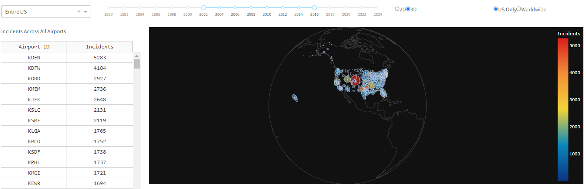

Overview

This directory contains one single file (faa_nwsd_python_dashboard.py), which is a script that was written to generate 
  a dashboard via Python with many different components to provide the partner with enhanced visualizations to better 
  represent the data in the National Wildlife Strike Database.

 

Dashboard Components

A breakdown for each dashboard componenet and a brief description of its capabilities are provided below.

1. Dashboard Tab 1

The first tab has 3 available filter options. The user can select a particular FAA region to filter the data within as well as filter the data within a particular time frame of years using the slider. The user can also select whether to show all airports when a state is selected or only the top 10 airports by incident count (more on this in section 1a). The FAA regions are defined below: 

<ul>
    <li>Alaskan: AK</li>
    <li>Central: IA, KS, MO, NE</li>
    <li>Eastern: DC, DE, MD, NJ, NY, PA, VA, WV </li>
    <li>Great Lakes: IL, IN, MI, MN, ND, OH, SD, WI </li>
    <li>New England: CT, MA, ME, NH, RI, VT </li>
    <li>Northwest Mountain: CO, ID, MT, OR, UT, WA, WY </li>
    <li>Southern: AL, FL, GA, KY, MS, NC, PR, SC, TN, VI </li>
    <li>Southwest: AR, LA, NM, OK, TX </li>
    <li>Western-Pacific: AZ, CA, HI, NV 
</li>
</ul>

1a. Choropleth Plot

The choropleth plot will show the number of incidents by state for the filtered time frame and FAA region. The user can hover over any state to see the corresponding number of incidents for the time frame. If the user selects the default "Entire US" option, all incidents across the United States will be plotted as shown in the above image. However, if the user selects a specific FAA region, the map will automatically update and show only the incidents accordingly for the filtered state(s). If the user clicks on any state, a new window will open with an interactive bar chart that displays incidents by the airports in the selected state (more on this in section 1d). 

1b. Line Graph

The line graph above will update accordingly based on the filters at the top of this tab and show the total incident count for the selected region broken down by year to show any trends or insights when looking at incidents by year. Example: for the entire U.S., there is clearly an uptick post-2009 thanks in part to the Miracle on the Hudson event. Example 2: In 2020, there is a distinct drop in airstrike incidents because of the COVID-19 global pandemic.

1c. Sun Burst Plot

The sun burst plot shows incidents grouped by state then by airport. If the user selects a particular state, the choropleth map will update to filter the map to only show that specific state and the sun burst plot will display the parent state and the airports in that state by ID with their associated incident counts. 

 

1d. Incident Bar Graph

This bar chart figure will display once a state is clicked by the user. It can be filtered to show all airports in the state or just the top ten airports by incident count using the filter option on the main tab. The plot is sorted in descending order and the user can hover to see the associated information for each airport. The figure also allows for interactive zooming so a user can highlight and pinpoint certain airports as well as allow the user to zoom in or out. The example above shows incidents for all airports in Texas (top) and only the top ten in the state (bottom).

 

2. Dashboard Tab 2

The second tab has 4 available filter options. Once again, as in the first tab, the user can filter by FAA region or a particular time frame. In addition, the user can select to plot the scatter heat map in 2D vs. 3D as well as filter the data to only display data for the United States only or worldwide (excluding the U.S.). Both of these filter options relate to the scatter heat map discussed below in section 2a.

2a. Scatter Heat Map 2D

The 2D scatter heat map displays airstrike incidents by specific airports using their latitude and longitude as provided in the data from the National Wildlife Strike Database. This figure allows users to easily visualize the frequency of reporting for all airstrike data within filtered regions and/or time frames. The interactive capability not only allows users to move the cursor over the map to see markers and data associated with each point, but it also allows for zooming into certain regions, states, or metropolitan areas. Furthermore, the plot also allows the user to select particular airports to view airstrikes by runway at a selected airport (more on this in section 2c). The image above shows the scatter heat map for the entire U.S., while the two images below show the data filtered to just incidents in the Southern FAA region (top) and worldwide incidents excluding the U.S. (bottom). 

2b. Scatter Heat Map 3D

The three-dimensional scatter heat map plots the data on an interactive 3D globe. This plot will be displayed when the user selects the 3D filter option in the filter row. This scatter geo plot is very similar to the two-dimensional version of the map, but this globe allows the user to scroll to any part of the world and see the incidents on a 3D scale versus only 2D as well as data spread out across the entire world. Data for only the United States is shown above, while below shows incidents on the worldwide scale excluding the incidents in the U.S.

2c. Incidents by Runway Scatter Heat Map

The incidents by runway scatter heat map plot is a feature that would be of great benefit to stakeholders as a way to visualize the data of specific airports by runways. To generate this image, the user just has to click on an airport on the 2D scatter heatmap to pop up this additional drilldown plot. A significant amount of data cleaning was required to ensure the runway column was properly formatted and cleaned to generate one single plot for a particular airport so this feature is only available when the user selects one of the airports below. The image above shows the incidents by runway for the four runways located at Washington Dulles International Airport (IAD).

<ul>
    <li>ATL: Atlanta Hartsfield-Jackson International Airport</li>
    <li>DEN: Denver International Airport</li>
    <li>DFW: Dallas/Fort Worth International Airport </li>
    <li>IAD: Washington Dulles International Airport</li>
    <li>JFK: New York John F Kennedy International Airport </li>
    <li>LAX: Los Angeles International Airport </li>
    <li>MCO: Orlando International Airport</li>
    <li>MEM: Memphis International Airport </li>
    <li>ORD: Chicago O'Hare International Airport </li>
    <li>SLC: Salt Lake City International Airport </li>
</ul>
